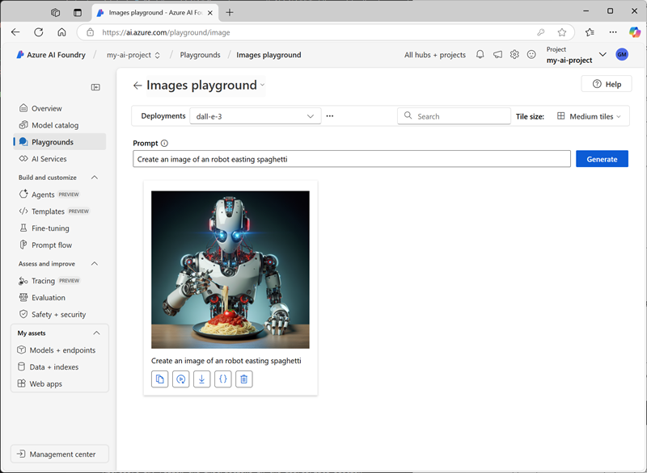

---
lab:
  title: Gerar imagens com IA
  description: Saiba como usar um modelo OpenAI DALL-E para gerar imagens.
  status: new
---

# Gerar imagens com IA

Neste exercício, você usará o modelo de IA generativa OpenAI DALL-E para gerar imagens. Você desenvolverá seu aplicativo usando a Fábrica de IA do Azure e o Serviço OpenAI do Azure.

Este exercício levará aproximadamente **30** minutos.

## Criar um projeto do Azure AI Foundry

Vamos começar criando um projeto da Fábrica de IA do Azure.

1. Em um navegador da Web, abra o [Portal da Fábrica de IA do Azure](https://ai.azure.com) em `https://ai.azure.com` e entre usando suas credenciais do Azure. Feche todas as dicas ou painéis de início rápido abertos na primeira vez que você entrar e, se necessário, use o logotipo da **Fábrica de IA do Azure** no canto superior esquerdo para navegar até a home page, que é semelhante à imagem a seguir:

    

1. Na home page, selecione **+Criar projeto**.
1. No assistente **Criar um projeto**, insira um nome de projeto adequado (por exemplo, `my-ai-project`) e revise os recursos do Azure que serão criados automaticamente para dar suporte ao seu projeto.
1. Selecione **Personalizar** e especifique as seguintes configurações para o hub:
    - **Nome do hub**: *um nome exclusivo – por exemplo `my-ai-hub`*
    - **Assinatura**: *sua assinatura do Azure*
    - **Grupo de recursos**: *crie um novo grupo de recursos com um nome exclusivo (por exemplo, `my-ai-resources`) ou selecione um existente*
    - **Localização**: selecione **Ajude-me a escolher** e **dalle** na janela do auxiliar de localização e use a região recomendada\*
    - **Conectar os Serviços de IA do Azure ou o OpenAI do Azure:*** crie um novo recurso de Serviços de IA com um nome apropriado (por exemplo, `my-ai-services`) ou use um existente*
    - **Conectar-se à Pesquisa de IA do Azure**: Ignorar a conexão

    > \* Os recursos do OpenAI do Azure são restringidos no nível do locatário por cotas regionais. No caso de um limite de cota ser atingido mais adiante no exercício, há a possibilidade de você precisar criar outro recurso em uma região diferente.

1. Clique em **Avançar** e revise a configuração. Em seguida, selecione **Criar** e aguarde a conclusão do processo.
1. Quando o projeto for criado, feche todas as dicas exibidas e examine a página do projeto no Portal da Fábrica de IA do Azure, que deve ser semelhante à imagem a seguir:

    

## Implantar um modelo DALL-E

Agora você já pode implantar um modelo DALL-E para dar suporte à geração de imagens.

1. Na barra de ferramentas no canto superior direito da página do projeto da Fábrica de IA do Azure, use o ícone **Recursos de visualização** para ativar o recurso **Implantar modelos para o serviço de inferência de modelo de IA do Azure**.
1. No painel à esquerda do seu projeto, na seção **Meus ativos**, selecione a página **Modelos + pontos de extremidade**.
1. Na página **Modelos + pontos extremidades**, na guia **Implantações de modelo**, no menu **+ Implantar modelo**, selecione **Implantar modelo base**.
1. Procure o modelo **dall-e-3** na lista, selecione-o e confirme-o.
1. Concorde com o contrato de licença, se solicitado, e implante o modelo com as seguintes configurações selecionando **Personalizar** nos detalhes da implantação:
    - **Nome de implantação**: *um nome exclusivo para sua implantação de modelo – por exemplo `dall-e-3` (lembre-se do nome que você atribui, você precisará dele mais tarde*)
    - **Tipo de implantação**: Padrão
    - **Detalhes da implantação**: *use as configurações padrão*
1. Aguarde que o estado de provisionamento de implantação seja **Concluído**.

## Testar o modelo no playground

Antes de criar um aplicativo cliente, vamos testar o modelo DALL-E no playground.

1. Na página do modelo DALL-E implantado, selecione **Abrir no playground** (ou, na página **Playgrounds**, abra o **Playground Imagens**).
1. Certifique-se de que a implantação do modelo DALL-E esteja selecionada. Em seguida, na caixa **Prompt**, insira um prompt como `Create an image of an robot eating spaghetti`.
1. Revise a imagem resultante no playground:

    

1. Insira um prompt de acompanhamento, como `Show the robot in a restaurant`, e revise a imagem resultante.
1. Continue testando novos prompts para refinar a imagem até estar contente com o resultado.

## Criar um aplicativo cliente

O modelo parece funcionar no playground. Agora você pode usar o SDK do OpenAI do Azure para usá-lo em um aplicativo cliente.

> **Dica**: você pode optar por desenvolver sua solução usando Python ou Microsoft C#. Siga as instruções na seção apropriada para o idioma escolhido.

### Preparar a configuração de aplicativo

1. No Portal da Fábrica de IA do Azure, visualize a página **Visão geral** do seu projeto.
1. Na área **Detalhes do projeto**, observe a **Cadeia de conexão do projeto**. Você usará essa cadeia de conexão para se conectar ao seu projeto em um aplicativo cliente.
1. Abra uma nova guia do navegador (mantendo o portal da Fábrica de IA do Azure aberto na guia existente). Em seguida, na nova guia, navegue até o [portal do Azure](https://portal.azure.com) em `https://portal.azure.com`; efetue login com suas credenciais do Azure, se solicitado.
1. Use o botão **[\>_]** à direita da barra de pesquisa na parte superior da página para criar um Cloud Shell no portal do Azure selecionando um ambiente do ***PowerShell***. O Cloud Shell fornece uma interface de linha de comando em um painel na parte inferior do portal do Azure.

    > **Observação**: se você já criou um Cloud Shell que usa um ambiente *Bash*, alterne-o para o ***PowerShell***.

1. Na barra de ferramentas do Cloud Shell, no menu **Configurações**, selecione **Ir para a versão clássica** (isso é necessário para usar o editor de código).

    > **Dica**: conforme você colar comandos no cloudshell, a saída pode ocupar uma grande quantidade do espaço da tela. Você pode limpar a tela digitando o comando `cls` para facilitar o foco em cada tarefa.

1. No painel do PowerShell, insira os seguintes comandos para clonar o repositório GitHub para este exercício:

    ```
    rm -r mslearn-openai -f
    git clone https://github.com/microsoftlearning/mslearn-openai mslearn-openai
    ```

> **Observação**: siga as etapas para a linguagem de programação escolhida.

1. Após o repositório ser clonado, navegue até a pasta que contém os arquivos de código do aplicativo:  

    **Python**

    ```
   cd mslearn-openai/Labfiles/03-image-generation/Python
    ```

    **C#**

    ```
   cd mslearn-openai/Labfiles/03-image-generation/CSharp
    ```

1. No painel de linha de comando do Cloud Shell, digite o seguinte comando para instalar as bibliotecas que você usará:

    **Python**

    ```
   pip install python-dotenv azure-identity azure-ai-projects openai requests
    ```

    *Você pode ignorar erros sobre a versão do pip e o caminho local*

    **C#**

    ```
   dotnet add package Azure.Identity
   dotnet add package Azure.AI.Projects --prerelease
   dotnet add package Azure.AI.OpenAI
    ```

1. Digite o seguinte comando para editar o arquivo de configuração que foi fornecido:

    **Python**

    ```
   code .env
    ```

    **C#**

    ```
   code appsettings.json
    ```

    O arquivo é aberto em um editor de código.

1. No arquivo de código, substitua o espaço reservado **your_project_endpoint** pela cadeia de conexão do projeto (copiada da página **Visão Geral** do projeto no portal da Fábrica de IA do Azure) e o espaço reservado **your_model_deployment** pelo nome que você atribuiu à implantação do modelo dall-e-3.
1. Depois de substituir os espaços reservados, use o comando **CTRL+S** para salvar suas alterações e, em seguida, use o comando **CTRL+Q** para fechar o editor de código, mantendo a linha de comando do Cloud Shell aberta.

### Escrever código para se conectar ao seu projeto e conversar com seu modelo

> **Dica**: ao adicionar código, certifique-se de manter o recuo correto.

1. Digite o seguinte comando para editar o arquivo de código que foi fornecido:

    **Python**

    ```
   code dalle-client.py
    ```

    **C#**

    ```
   code Program.cs
    ```

1. No arquivo de código, observe as instruções existentes que foram adicionadas na parte superior do arquivo para importar os namespaces do SDK necessários. Em seguida, no comentário **Adicionar referências**, adicione o seguinte código para referenciar os namespaces nas bibliotecas que você instalou anteriormente:

    **Python**

    ```
   from dotenv import load_dotenv
   from azure.identity import DefaultAzureCredential
   from azure.ai.projects import AIProjectClient
   from openai import AzureOpenAI
   import requests
    ```

    **C#**

    ```
   using Azure.Identity;
   using Azure.AI.Projects;
   using Azure.AI.OpenAI;
   using OpenAI.Images;
    ```

1. Na função **main**, no comentário **Get configuration settings**, observe que o código carrega a cadeia de conexão do projeto e os valores do nome de implantação do modelo que você definiu no arquivo de configuração.
1. No comentário **Initialize the project client**, adicione o seguinte código para se conectar ao seu projeto da Fábrica de IA do Azure usando as credenciais do Azure com as quais você está conectado no momento:

    **Python**

    ```
   project_client = AIProjectClient.from_connection_string(
        conn_str=project_connection,
        credential=DefaultAzureCredential())
    ```

    **C#**

    ```
   var projectClient = new AIProjectClient(project_connection,
                        new DefaultAzureCredential());
    ```

1. No comentário **Get an OpenAI client**, adicione o seguinte código para criar um objeto cliente para conversar com um modelo:

    **Python**

    ```
   openai_client = project_client.inference.get_azure_openai_client(api_version="2024-06-01")

    ```

    **C#**

    ```
   ConnectionResponse connection = projectClient.GetConnectionsClient().GetDefaultConnection(ConnectionType.AzureOpenAI, withCredential: true);

   var connectionProperties = connection.Properties as ConnectionPropertiesApiKeyAuth;

   AzureOpenAIClient openAIClient = new(
        new Uri(connectionProperties.Target),
        new AzureKeyCredential(connectionProperties.Credentials.Key));

   ImageClient openAIimageClient = openAIClient.GetImageClient(model_deployment);

    ```

1. Observe que o código inclui um loop para permitir que o usuário insira um prompt até digitar "quit". Em seguida, na seção de loop, no comentário **Generate an image**, adicione o seguinte código para enviar o prompt e recuperar o URL da imagem gerada a partir do modelo:

    **Python**

    ```python
   result = openai_client.images.generate(
        model=model_deployment,
        prompt=input_text,
        n=1
    )

    json_response = json.loads(result.model_dump_json())
    image_url = json_response["data"][0]["url"] 
    ```

    **C#**

    ```
   var imageGeneration = await openAIimageClient.GenerateImageAsync(
            input_text,
            new ImageGenerationOptions()
            {
                Size = GeneratedImageSize.W1024xH1024
            }
   );
   imageUrl= imageGeneration.Value.ImageUri;
    ```

1. O código no restante da função **main** passa o URL da imagem e um nome de arquivo para uma função fornecida, que baixa a imagem gerada e a salva como um arquivo .png.

1. Use o comando **CTRL+S** para salvar suas alterações no arquivo de código e, em seguida, use o comando **CTRL+Q** para fechar o editor de código, mantendo a linha de comando do Cloud Shell aberta.

### Executar o aplicativo cliente

1. No painel de linha de comando do Cloud Shell, insira o seguinte comando para executar o aplicativo:

    **Python**

    ```
   python dalle-client.py
    ```

    **C#**

    ```
   dotnet run
    ```

1. Quando solicitado, insira uma solicitação de imagem, como `Create an image of a robot eating pizza`. Após alguns instantes, o aplicativo confirmará que a imagem foi salva.
1. Teste mais alguns prompts. Quando terminar, digite `quit` para sair do programa.

    > **Observação**: neste aplicativo simples, não implementamos lógica para reter o histórico da conversa; portanto, o modelo tratará cada prompt como uma nova solicitação sem contexto do prompt anterior.

1. Para baixar e exibir as imagens geradas pelo seu aplicativo, na barra de ferramentas do painel do Cloud Shell, use o botão **Carregar/Baixar arquivos** para baixar um arquivo e abra-o. Para baixar um arquivo, preencha o caminho do arquivo na interface de download; por exemplo:

    **Python**

    /home/*user*`/mslearn-openai/Labfiles/03-image-generation/Python/images/image_1.png`

    **C#**

    /home/*user*`/mslearn-openai/Labfiles/03-image-generation/CSharp/images/image_1.png`

## Resumo

Neste exercício, você usou a Fábrica de IA do Azure e o SDK do OpenAI do Azure para criar um aplicativo cliente usando um modelo DALL-E para gerar imagens.

## Limpar

Se tiver terminado de explorar o modelo DALL-E, você deverá excluir os recursos que criou neste exercício para evitar incorrer em custos desnecessários do Azure.

1. Retorne à guia do navegador que contém o portal do Azure (ou reabra o [portal do Azure](https://portal.azure.com) em `https://portal.azure.com` em uma nova guia do navegador) e visualize o conteúdo do grupo de recursos onde você implantou os recursos usados neste exercício.
1. Na barra de ferramentas, selecione **Excluir grupo de recursos**.
1. Insira o nome do grupo de recursos e confirme que deseja excluí-lo.
